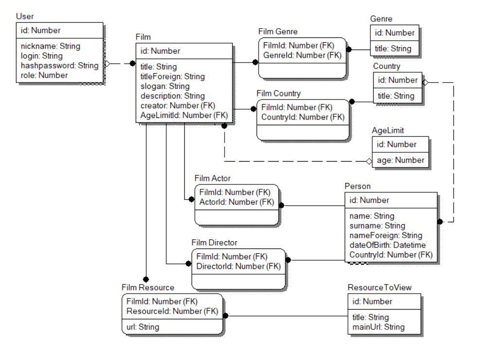

# Агрегатор фильмов

Веб приложение хранит основную информацию о фильмах и площадках на которых доступен просмотр данных фильмов.

## Виды пользователей:
- Гость - может просматривать существующие записи
- Редактор - может добавлять и редактировать записи о фильмах
- Администратор - возможности редактора + Добавление новых редакторов

## Требования к проекту:
### Гость
- возможность просмотра списка фильмов (INDEX)
- возможность просмотра записей о фильмах(READ)

### Редактор
- возможность просмотра списка фильмов (INDEX)
- возможность просмотра подробной информации о фильме (READ)
- возможность создание записи о новом фильме (CREATE)
- возможность редактирования записи о фильме (UPDATE)
- возможность удаление записи о фильме (DELETE)

### Администратор
- все предыдущие возможности
- возможность создания нового редактора, изменение информации о нём и удаление

## База данных

